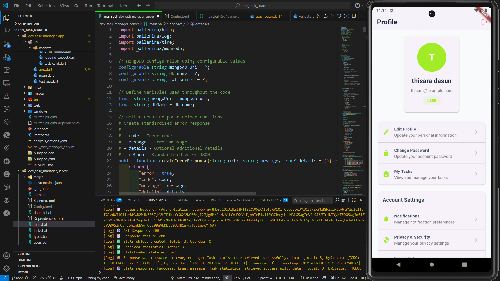
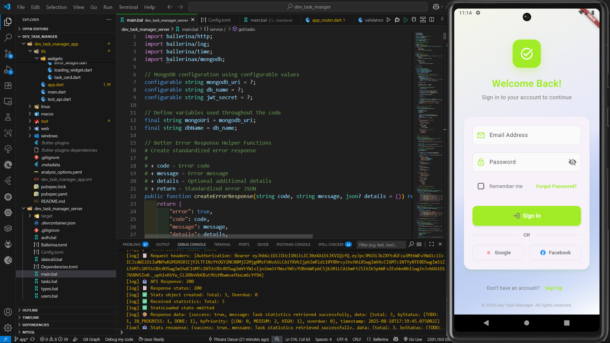
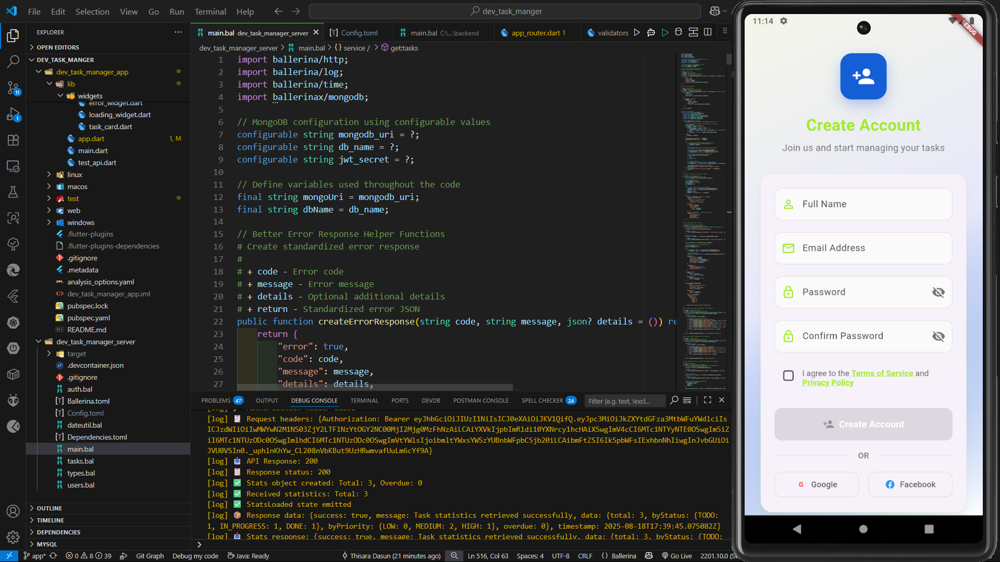

# Dev Task Manager Platform

A modern cross-platform solution for managing development tasks, featuring a Flutter app and a Ballerina backend server.

## � App Screenshots

### Dashboard & Task Management

*Main dashboard showing task statistics, quick actions, and user welcome*

### User Profile Management

*Profile screen with user information, settings, and account management options*

### Authentication

*User login interface with email/password authentication and social login options*


*Account creation form with user registration fields and terms acceptance*

## �🚀 Features

### Dev Task Manager App (Flutter)

- Task creation, editing, and deletion
- User authentication and profile management
- Task assignment and status tracking
- Notifications for deadlines and updates
- Responsive UI for mobile and desktop
- Integration with backend for real-time data sync

### Ballerina Server

- RESTful API for task management
- User authentication and authorization
- Task CRUD operations
- Date and time utilities
- MongoDB integration for persistent storage
- Modular implementation: `auth.bal`, `tasks.bal`, `users.bal`, `dateutil.bal`, `types.bal`, `main.bal`

## 🛠️ Tech Stack

- **Frontend:** Flutter (Dart)
- **Backend:** Ballerina
- **Database:** MongoDB

## ⚙️ Prerequisites

Install the following on your machine:

- Flutter SDK
- Ballerina
- MongoDB

## 📦 Project Structure

```
dev_task_manger/
├── dev_task_manager_app/      # Flutter app
│   ├── lib/
│   │   ├── app.dart
│   │   ├── main.dart
│   │   ├── test_api.dart
│   │   ├── blocs/
│   │   ├── config/
│   │   ├── models/
│   │   ├── routes/
│   │   ├── screens/
│   │   ├── services/
│   │   ├── utils/
│   │   └── widgets/
│   ├── android/
│   ├── ios/
│   ├── web/
│   ├── test/
│   └── ...
└── dev_task_manager_server/   # Ballerina backend
   ├── main.bal
   ├── auth.bal
   ├── tasks.bal
   ├── users.bal
   ├── dateutil.bal
   ├── types.bal
   ├── Ballerina.toml
   ├── Config.toml
   ├── Dependencies.toml
   └── ...
```

## 🧑‍💻 Frontend Implementation Guide

1. **Setup Flutter Environment**

- Install Flutter SDK and dependencies.
- Run `flutter pub get` in `dev_task_manager_app`.

2. **App Structure**

- `lib/main.dart`: Entry point of the app.
- `lib/app.dart`: App configuration and theme.
- `lib/blocs/`: State management (e.g., Bloc/Cubit files).
- `lib/models/`: Data models for tasks, users, etc.
- `lib/screens/`: UI screens (login, dashboard, task list, etc.).
- `lib/services/`: API calls and backend integration.
- `lib/utils/`: Utility functions and helpers.
- `lib/widgets/`: Reusable UI components.

3. **Connecting to Backend**

- Use `lib/services/` to implement HTTP requests to Ballerina server endpoints.
- Store API base URL in a config file for easy updates.

4. **Running the App**

- Use `flutter run` to launch the app on your device/emulator.

## 🧑‍💻 Backend Implementation Guide

1. **Setup Ballerina Environment**

- Install Ballerina and MongoDB.
- Configure `Config.toml` for database connection and environment variables.

2. **Service Structure**

- `main.bal`: Entry point, composes all services.
- `auth.bal`: Handles authentication, JWT, and user sessions.
- `tasks.bal`: Implements endpoints for task CRUD and assignment.
- `users.bal`: Manages user profiles and permissions.
- `dateutil.bal`: Date/time utility functions.
- `types.bal`: Shared type definitions for requests/responses.

3. **Running the Server**

- Use `bal run` in `dev_task_manager_server` to start the backend.
- Server runs at `http://localhost:9090` by default.

4. **API Endpoints**

- See inline comments in `.bal` files for endpoint details and usage.

## � Setup Instructions

### 1. Clone the Repository

```bash
git clone <repo-url>
cd <repo-folder>
```

### 2. Database Setup

- Start MongoDB locally (default: `mongodb://localhost:27017`)
- Database and collections are auto-created on first run

### 3. Flutter App Setup

```bash
cd dev_task_manger/dev_task_manager_app
flutter pub get
flutter run
```

### 4. Ballerina Server Setup

```bash
cd dev_task_manger/dev_task_manager_server
bal run
```

Ballerina server runs on: `http://localhost:9090`

## � Configuration

Edit `Config.toml` in `dev_task_manager_server` to set MongoDB connection and other environment variables.

## 📚 Implementation Details

- **auth.bal**: Handles user authentication and JWT logic
- **tasks.bal**: Implements task CRUD and assignment endpoints
- **users.bal**: Manages user profiles and permissions
- **dateutil.bal**: Utility functions for date/time
- **types.bal**: Shared type definitions
- **main.bal**: Entry point and service composition

## 📝 API Documentation

See inline comments in Ballerina source files for endpoint details and usage examples.

#DevTaskManager #BallerinaLang #Flutter #MongoDB #TaskManagement
